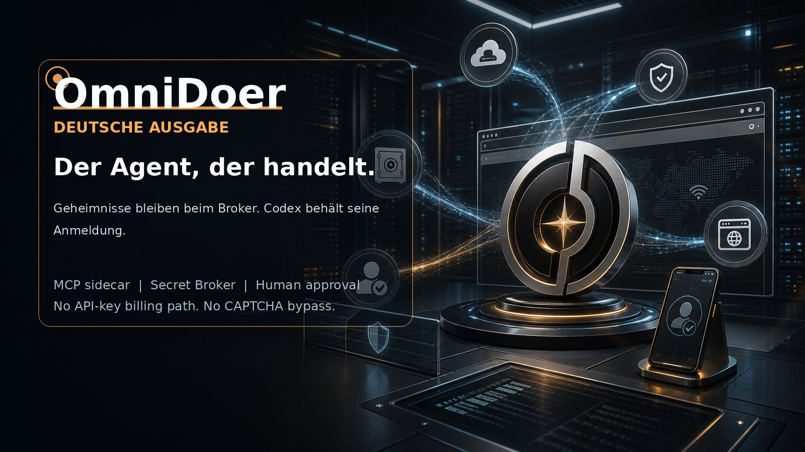

# OmniDoer

[English](./README.md) | [中文](./README.zh-CN.md) | [Español](./README.es.md) | [Français](./README.fr.md) | [日本語](./README.ja.md) | [한국어](./README.ko.md)

OmniDoer erweitert Codex CLI über MCP und einen lokalen beziehungsweise Cloud-Direct-Sidecar. Es ist kein neuer OpenAI API Client. Codex bleibt der einzige Einstiegspunkt für Modellinferenz, und OmniDoer bewahrt Codex-Authentifizierung und Codex-Abrechnung.

Der Agent darf die Nutzung eines Secrets anfordern, aber er darf das Secret nicht lesen. Passwörter, Verifizierungscodes, TOTP-Seeds, Cookies, private Schlüssel und Zahlungsdaten bleiben im Secret Broker, Vault, Browser Controller und Control Client.

Control Client bündelt Aufgaben, Zugangsdaten, Challenges, Human Takeover, Konto-Registrierung, Zahlungsfreigaben und Auditansicht. Bei CAPTCHA, MFA, Passkey, WebAuthn, 3DS und starken Anti-Bot-Seiten umgeht oder löst OmniDoer nichts automatisch; die Aufgabe geht an den Benutzer.

Cloud Direct Mode verbindet Android-, Windows-11- und PWA-Clients direkt mit dem eigenen Cloud-Server des Benutzers. Dafür sind HTTPS/WSS, Pairing, Geräteidentität, Sessions, CSRF/Origin-Schutz, Rate Limits und E2EE Secret Submission vorgesehen.
