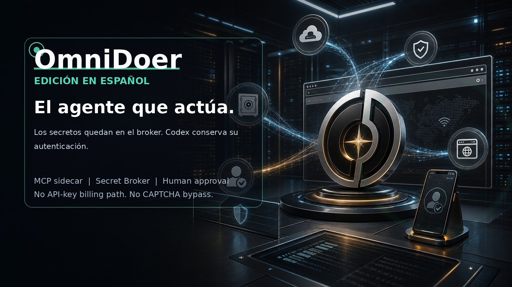

# OmniDoer



[English](./README.md) | [中文](./README.zh-CN.md) | [Français](./README.fr.md) | [Deutsch](./README.de.md) | [日本語](./README.ja.md) | [한국어](./README.ko.md)

## Instalación rápida

Instalación local:

```sh
curl -fsSL https://raw.githubusercontent.com/OmniDoer/omnidoer/main/omnidoer/scripts/install-cloud-direct.sh | sh
```

Servidor Cloud Direct detrás de tu propio proxy HTTPS:

```sh
curl -fsSL https://raw.githubusercontent.com/OmniDoer/omnidoer/main/omnidoer/scripts/install-cloud-direct.sh | \
  OMNIDOER_CLOUD_DIRECT=1 OMNIDOER_PUBLIC_URL=https://agent.example.com sh
```

Después de instalar:

```sh
~/omnidoer/.venv/bin/omnidoer control pair --print-qr
~/omnidoer/.venv/bin/omnidoer control submit-task "Use OmniDoer on the local demo"
```

El instalador crea `~/omnidoer/.venv`, inicializa OmniDoer, instala el browser
worker, prueba el servidor MCP y registra `omnidoer mcp serve` si `codex` CLI
está disponible.

OmniDoer extiende Codex CLI mediante MCP y un sidecar local/cloud-direct. No es un nuevo cliente de OpenAI API. Codex razona; OmniDoer actúa con un navegador real, Secret Broker, Vault, Control Client, Challenge Relay, Human Takeover, Cloud Direct, Approval Gate y auditoría.

Si una persona puede hacerlo en la web con autorización, OmniDoer está diseñado para ayudar a ejecutarlo de forma segura: registro, inicio de sesión, navegación, formularios, descargas, facturas, revisión de compras, aprobación de pagos y traspaso al usuario cuando el sitio exige intervención humana.

El agente puede solicitar una acción, pero no puede leer secretos. Las contraseñas, códigos de verificación, semillas TOTP, cookies, claves privadas y credenciales de pago permanecen dentro del Secret Broker, Vault, Browser Controller y Control Client.

Control Client reúne tareas, entrada de credenciales, desafíos de usuario, Human Takeover, registro de cuentas, aprobación de pagos y auditoría. Para CAPTCHA, MFA, Passkey, WebAuthn, 3DS, confirmación de registro y páginas anti-bot fuertes, OmniDoer no evita ni resuelve el desafío; lo entrega al usuario.

Cloud Direct Mode permite que Android, Windows 11 y clientes PWA se conecten directamente al servidor cloud propio del usuario con HTTPS/WSS, pairing, identidad de dispositivo, sesiones, protección CSRF/Origin, rate limit y envío E2EE de secretos.
