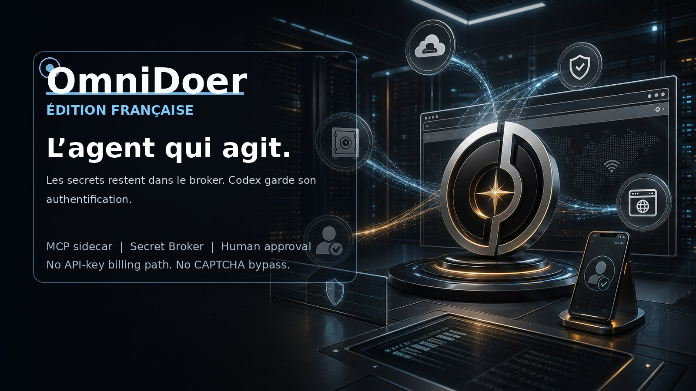

# OmniDoer

[English](./README.md) | [中文](./README.zh-CN.md) | [Español](./README.es.md) | [Deutsch](./README.de.md) | [日本語](./README.ja.md) | [한국어](./README.ko.md)

OmniDoer étend Codex CLI au moyen d’un serveur MCP et d’un sidecar local/cloud-direct. Ce n’est pas un nouveau client OpenAI API. Codex reste l’unique point d’entrée pour l’inférence du modèle, et OmniDoer préserve l’authentification et la facturation de Codex.

L’agent peut demander l’utilisation d’un secret, mais il ne peut jamais le lire. Les mots de passe, codes de vérification, graines TOTP, cookies, clés privées et moyens de paiement restent dans le Secret Broker, le Vault, le Browser Controller et le Control Client.

Control Client regroupe les tâches, la saisie des identifiants, les défis utilisateur, Human Takeover, l’inscription de compte, les approbations de paiement et l’audit. Pour CAPTCHA, MFA, Passkey, WebAuthn, 3DS et anti-bot fort, OmniDoer ne contourne rien et confie l’action à l’utilisateur.

Cloud Direct Mode permet aux clients Android, Windows 11 et PWA de se connecter directement au serveur cloud de l’utilisateur avec HTTPS/WSS, pairing, identité d’appareil, sessions, protections CSRF/Origin, rate limit et soumission E2EE des secrets.
