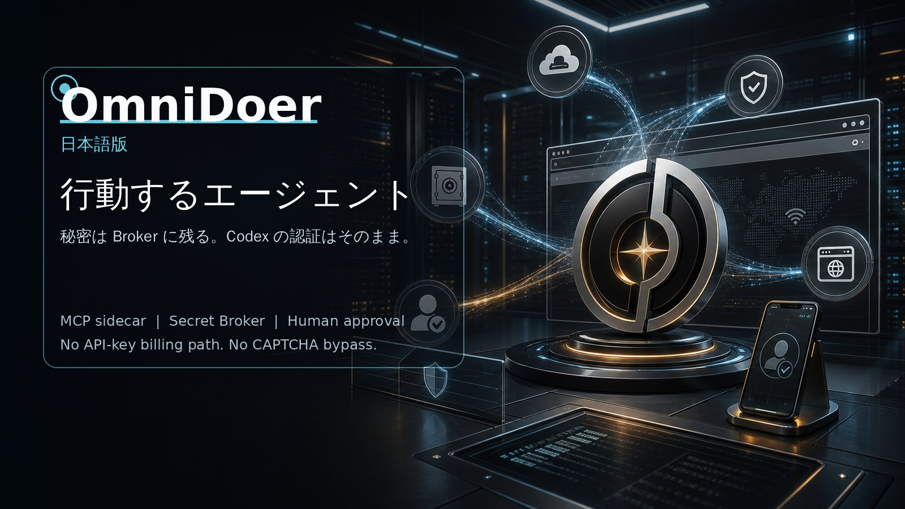

# OmniDoer



[English](./README.md) | [中文](./README.zh-CN.md) | [Español](./README.es.md) | [Français](./README.fr.md) | [Deutsch](./README.de.md) | [한국어](./README.ko.md)

## クイックインストール

ローカル開発環境:

```sh
curl -fsSL https://raw.githubusercontent.com/OmniDoer/omnidoer/main/omnidoer/scripts/install-cloud-direct.sh | sh
```

自分の HTTPS リバースプロキシ配下の Cloud Direct サーバー:

```sh
curl -fsSL https://raw.githubusercontent.com/OmniDoer/omnidoer/main/omnidoer/scripts/install-cloud-direct.sh | \
  OMNIDOER_CLOUD_DIRECT=1 OMNIDOER_PUBLIC_URL=https://agent.example.com sh
```

インストール後:

```sh
~/omnidoer/.venv/bin/omnidoer control pair --print-qr
~/omnidoer/.venv/bin/omnidoer control submit-task "ローカルデモを開いて請求書をダウンロードする"
```

インストーラは `~/omnidoer/.venv` を作成し、OmniDoer を初期化し、
browser worker をインストールし、MCP server を self-test し、`codex` CLI
がある場合は `omnidoer mcp serve` を登録します。

OmniDoer は Codex CLI を MCP と sidecar で拡張するローカル優先、Cloud Direct 対応の実行基盤です。新しい OpenAI API クライアントではありません。Codex が推論し、OmniDoer が実ブラウザ、Secret Broker、Vault、Control Client、Challenge Relay、Human Takeover、Cloud Direct、Approval Gate、監査で実行します。

人間が承認して Web 上で実行できる作業なら、OmniDoer はそれを安全に支援することを目指します。サインアップ、ログイン、ナビゲーション、フォーム入力、ダウンロード、請求書、購入確認、支払い承認、そしてサイトが人間の介入を求める場面でのユーザーへの操作引き渡しです。

Agent は secret の使用を要求できますが、secret 自体を読むことはできません。パスワード、認証コード、TOTP seed、Cookie、秘密鍵、支払い情報は Secret Broker、Vault、Browser Controller、Control Client の安全境界内に残ります。

Control Client はタスク入力、認証情報入力、チャレンジ処理、Human Takeover、アカウント登録の代理、支払い承認、監査表示を統合します。CAPTCHA、MFA、Passkey、WebAuthn、3DS、登録確認、強い anti-bot では、OmniDoer は回避や自動解答を行わず、ユーザー本人に操作を渡します。

Cloud Direct Mode では Android、Windows 11、PWA クライアントがユーザー自身のクラウドサーバーへ直接接続します。HTTPS/WSS、pairing、device identity、session、CSRF/Origin protection、rate limit、E2EE secret submission が必要です。
