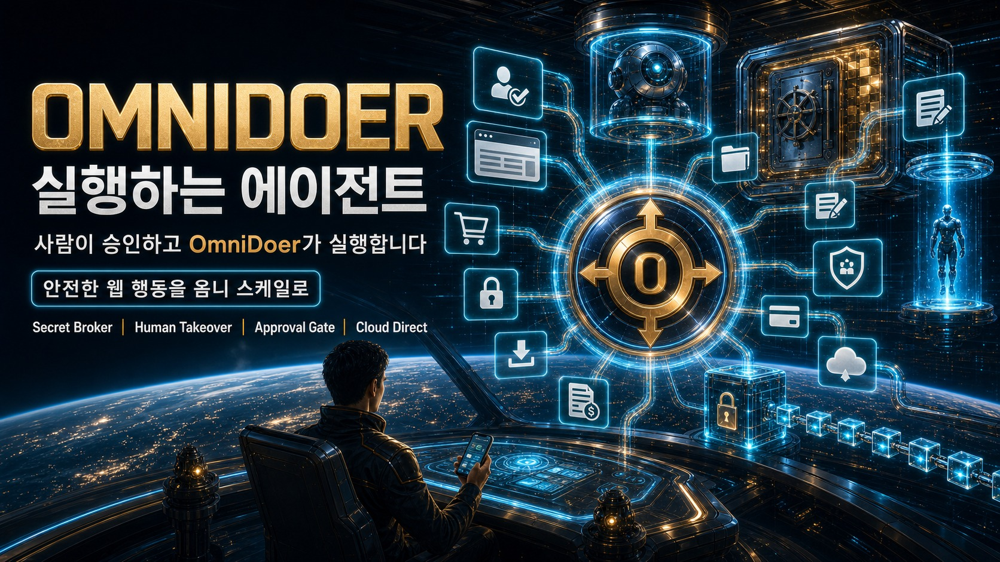

# OmniDoer

[English](./README.md) | [中文](./README.zh-CN.md) | [Español](./README.es.md) | [Français](./README.fr.md) | [Deutsch](./README.de.md) | [日本語](./README.ja.md)

OmniDoer는 Codex CLI를 MCP와 sidecar 방식으로 확장하는 local-first, cloud-direct 실행 계층입니다. 새로운 OpenAI API 클라이언트가 아닙니다. Codex는 추론하고, OmniDoer는 실제 브라우저, Secret Broker, Vault, Control Client, Challenge Relay, Human Takeover, Cloud Direct, Approval Gate, 감사 체계로 실행합니다.

사람이 승인하고 웹에서 수행할 수 있는 일이라면 OmniDoer는 이를 안전하게 실행하도록 돕는 것을 목표로 합니다. 회원가입, 로그인, 탐색, 양식 입력, 다운로드, 청구서 확인, 구매 검토, 결제 승인, 그리고 사이트가 사람의 개입을 요구할 때 사용자에게 제어권을 넘기는 흐름을 포함합니다.

Agent는 secret 사용을 요청할 수 있지만 secret 자체를 읽을 수 없습니다. 비밀번호, 인증 코드, TOTP seed, Cookie, 개인키, 결제 정보는 Secret Broker, Vault, Browser Controller, Control Client의 보안 경계 안에 남습니다.

Control Client는 작업 입력, 자격 증명 입력, challenge 처리, Human Takeover, 계정 등록 위임, 결제 승인, 감사 로그 보기를 통합합니다. CAPTCHA, MFA, Passkey, WebAuthn, 3DS, 가입 확인, 강한 anti-bot 페이지에서는 OmniDoer가 우회하거나 자동 풀이하지 않고 사용자가 직접 완료합니다.

Cloud Direct Mode에서는 Android, Windows 11, PWA 클라이언트가 사용자의 클라우드 서버에 직접 연결합니다. HTTPS/WSS, pairing, device identity, session, CSRF/Origin protection, rate limit, E2EE secret submission이 필요합니다.
