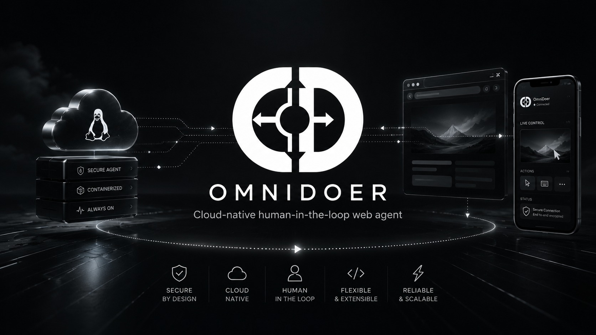
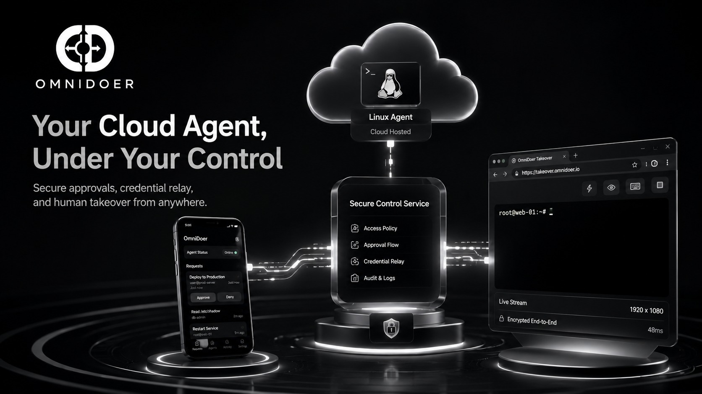
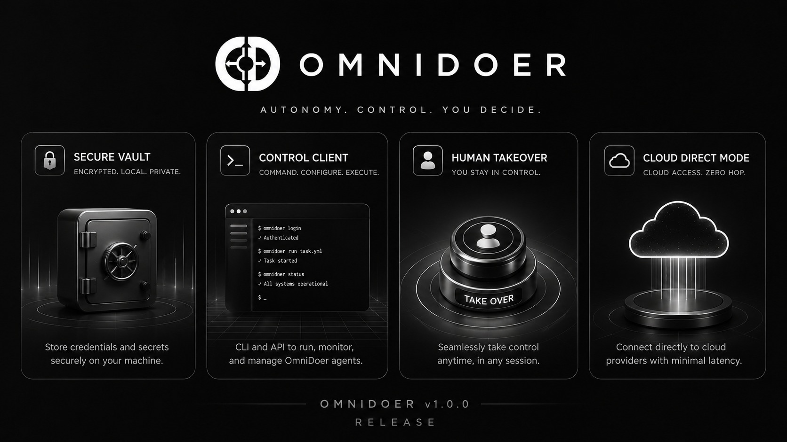
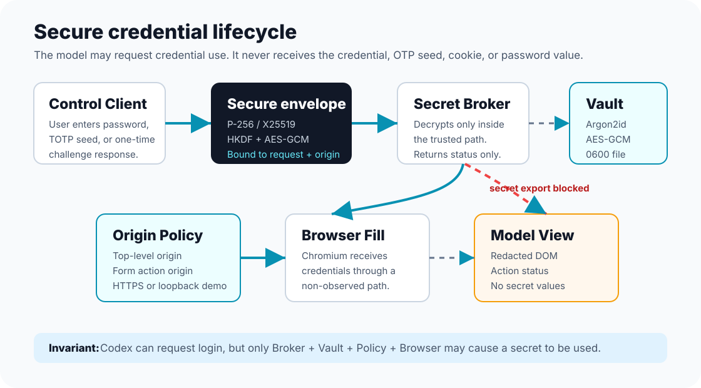
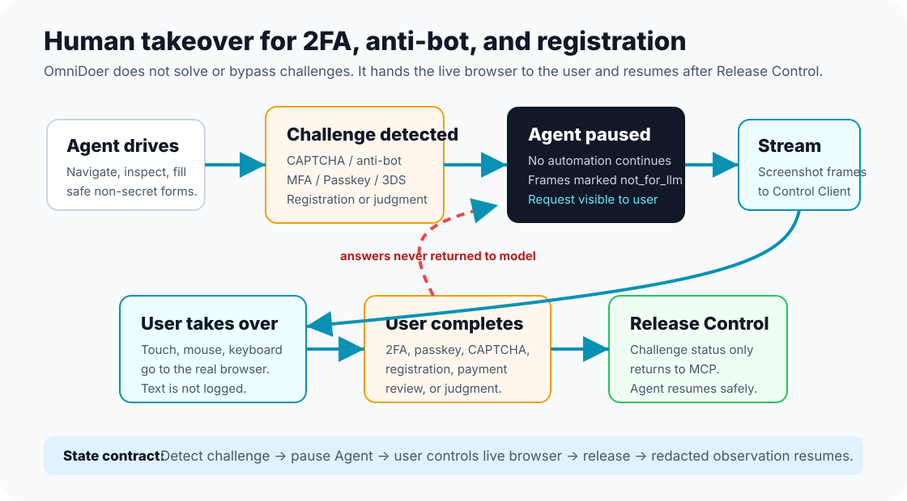
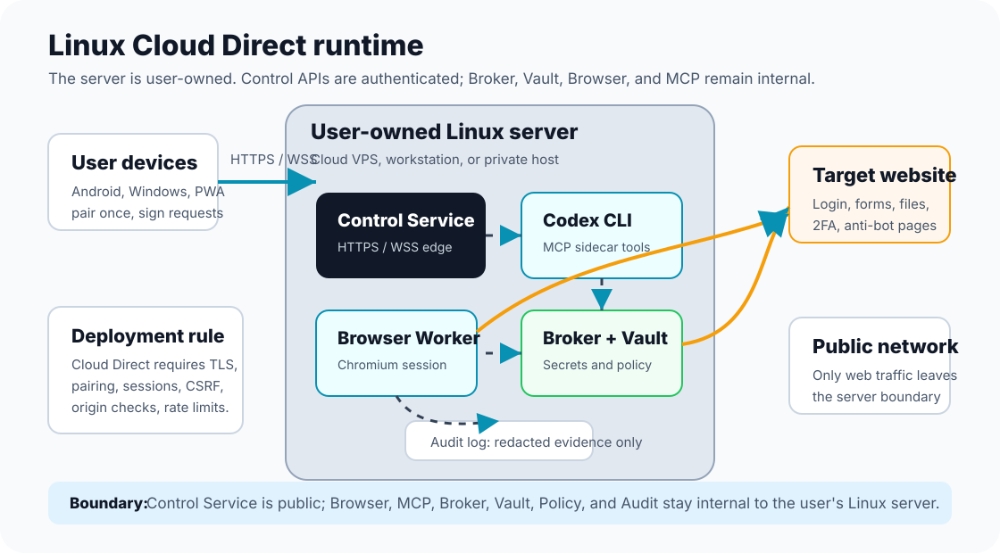
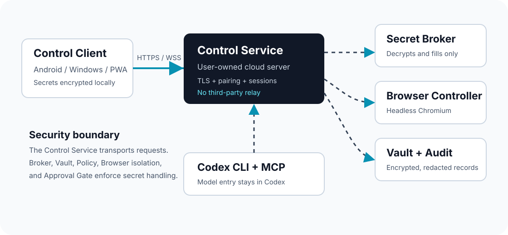

# OmniDoer

All-purpose web action, inside the security boundary.

**Secure control is what makes freedom possible.**


A white-hat security researcher found the uncomfortable gap in cloud coding
agents: once an agent runs on a real server, passwords, SSH keys, API tokens,
private keys, and wallet secrets can sit one tool call away. Asking the model to
"please avoid secrets" is a behavioral request, not an isolation boundary.

OmniDoer turns that finding into product architecture. Codex remains the
reasoning brain and keeps its login, model choice, and quota path. OmniDoer adds
the secure hands: controlled browser execution, Secret Broker, encrypted Vault,
approval gates, challenge relay, audit trail, and Control Client surfaces that
keep sensitive actions outside model-visible state.

The thesis is practical: if a person can legitimately complete a workflow in
their browser, OmniDoer should be able to orchestrate the same workflow on the
user's own Linux server without moving the security boundary into the model.

The core model is cloud-native. Codex remains the reasoning engine and keeps
its own authentication, model choice, and billing behavior. OmniDoer adds the
runtime plane: controlled browser, Secret Broker, encrypted Vault, Control Client,
challenge relay, approval gate, audit trail, and human takeover bridge that keep
secret state out of model context.

OmniDoer does not bypass anti-bot and challenge systems. It pauses at
authentication, registration, anti-bot judgment, passkey/WebAuthn steps, 3DS,
and payment consent, then projects the live browser session to the paired
user client for completion. After user release, the agent continues safely.
This gives broad web reach with hard limits enforced by design:

- **Safe secrets**: secrets, keys, OTP seeds, OAuth grants, and challenge answers
  stay in the encrypted secret control path.
- **Safe continuity**: the model plans, policy decides, and execution proceeds
  only after approved handoffs.
- **Safe economics**: cloud model capability is kept, while unsafe retries and
  unsafe automation detours are eliminated.

OmniDoer is built to execute the full spectrum of human-legal web tasks:
open sites, sign up, log in, navigate, fill forms, upload/download, prepare
purchases, and complete sensitive pages through user-approved handoff without
opening the security boundary.


Live page: [https://omnidoer.github.io/](https://omnidoer.github.io/)

## One-Command Install

Local developer install:

```sh
curl -fsSL https://raw.githubusercontent.com/OmniDoer/omnidoer/main/omnidoer/scripts/install-cloud-direct.sh | sh
```

Cloud Direct server install behind your own HTTPS reverse proxy:

```sh
curl -fsSL https://raw.githubusercontent.com/OmniDoer/omnidoer/main/omnidoer/scripts/install-cloud-direct.sh | \
  OMNIDOER_CLOUD_DIRECT=1 OMNIDOER_PUBLIC_URL=https://agent.example.com sh
```

The installer clones OmniDoer, creates `~/omnidoer/.venv`, installs the Python
sidecar runtime, installs the Chromium browser worker, runs `omnidoer init`,
self-tests the MCP server, registers `omnidoer mcp serve` with Codex when the
`codex` CLI is available, and starts the Control Service. It preserves your
existing Codex login, model selection, and billing path.

After install:

```sh
~/omnidoer/.venv/bin/omnidoer
~/omnidoer/.venv/bin/omnidoer pair
~/omnidoer/.venv/bin/omnidoer control submit-task "Open the local demo and download my invoice"
```

Running `omnidoer` with no subcommand opens the OmniDoer-branded interactive
console. It inherits the existing Codex ChatGPT login and billing path, but the
launcher sets OmniDoer branding so startup, status, and quota surfaces identify
the active console as OmniDoer when the bundled native console supports it.
When `/usr/local/lib/omnidoer/codex` is installed, that OmniDoer native console
is used first; otherwise `omnidoer` falls back to the preserved system Codex
binary at `/usr/bin/codex`.

### Native console account switching

Inside the native console, `/users` opens the saved local account switcher. The
selector lists accounts already logged in on this machine, marks the current
account, and supports arrow-key navigation plus Enter to switch. OmniDoer saves
each account in its own local auth slot, reloads the running app-server in
place, and keeps the current conversation context attached to the session. This
is useful when a task needs a different ChatGPT/Codex account capability or when
one account's quota is exhausted.

Credential values are never printed in the picker or logs. The account index
stores only display metadata; secrets remain in the configured local credential
store.

Upgrade the CLI and sidecar in place:

```sh
~/omnidoer/.venv/bin/omnidoer upgrade
~/omnidoer/.venv/bin/omnidoer --version
```

When launched from an interactive terminal, `omnidoer` checks `origin/main` for
a fast-forward update before opening the console and asks whether to run
`omnidoer upgrade`. Non-TTY launches skip the prompt, and
`OMNIDOER_UPDATE_CHECK=0` disables it.

Safely make `codex` resolve to the OmniDoer shim while preserving the original
Codex CLI at `/usr/bin/codex`:

```sh
sudo omnidoer/scripts/install-codex-shim.sh
omnidoer/scripts/verify-codex-shim.sh
```

Rollback is immediate:

```sh
sudo omnidoer/scripts/uninstall-codex-shim.sh
sudo rm -f /usr/local/lib/omnidoer/codex
```

Set `OMNIDOER_INSTALL_DIR`, `OMNIDOER_HOST`, `OMNIDOER_PORT`, `OMNIDOER_START=0`,
`OMNIDOER_REGISTER_MCP=0`, or `OMNIDOER_SKIP_PLAYWRIGHT=1` to customize the
bootstrap.

Available translations:
[中文](./README.zh-CN.md) |
[Español](./README.es.md) |
[Français](./README.fr.md) |
[Deutsch](./README.de.md) |
[日本語](./README.ja.md) |
[한국어](./README.ko.md)

## Product Promise

OmniDoer exists to make Codex/GPT web action practical without moving the
security boundary into the model.

Execution architecture:

- **Reasoning**: Codex (cloud model) provides planning, multimodal observation,
  and language control.
- **Execution**: Control Client and browser automation run on the user's own
  Linux server.
- **Security plane**: Secret Broker, encrypted Vault, approval gate, challenge
  relay, human takeover channel, and tamper-evident audit log enforce hard
  boundaries.

### Why OmniDoer is beyond OpenClaw-style automation and prompt-only Codex usage

This project targets the gap where two existing patterns fail:

- **OpenClaw-style automation** can click through pages but reaches a wall at
  anti-bot checks, registration handoff, CAPTCHA flow, and payment consent.
- **Prompt-only Codex usage** can reason clearly but has no safe execution plane
  for real browser workflows.

OmniDoer fills that gap by keeping Codex at the reasoning layer and adding:

- **Secure cloud execution plane** on the user's own Linux server, not in model
  prompts.
- **Codex-plan + secure-runtime execution** for high-frequency browser flows.
- **Human takeover on demand** for CAPTCHA, anti-bot, passkey/WebAuthn, 3DS,
  account registration, OAuth consent, and other sensitive gates.
- **Payment gates with explicit approval** before spend, account change, or
  message sending.

Security and autonomy are intentionally coupled:

- **Cost-optimal planning**: Codex billing remains the primary control plane; the
  runtime reuses your existing session model and avoids duplicated API clients.
- **Cloud-grade multimodal execution**: model reasoning and visual observation keep
  GPT strengths while secrets and one-time challenge answers never enter model
  context.
- **Smoother autonomy**: the model runs the safe part automatically, then switches
  to human completion at challenge/consent thresholds and resumes after release.

#### Practical comparison

| Stage                                   | OpenClaw/macros                              | Prompt-only Codex                                   | OmniDoer                                                           |
| --------------------------------------- | -------------------------------------------- | --------------------------------------------------- | ------------------------------------------------------------------ |
| Repetitive page workflows               | ✅ high throughput                           | ✅ with manual prompting                            | ✅ with Codex planning and MCP execution                           |
| Anti-bot, CAPTCHA, or passkey           | ❌ usually blocked                           | ⚠️ can detect intent but no safe execution boundary | ✅ pauses and streams the live browser to the user for completion  |
| Registration, account recovery, consent | ❌ cannot complete without unsafe automation | ⚠️ can draft steps, not safely execute              | ✅ user-completion handoff through the same Cloud Direct stream    |
| Payments, purchases, account changes    | ❌ unsafe if automated                       | ⚠️ can overact without explicit approval flow       | ✅ scoped approval gate with replay protection                     |
| Secret custody                          | Usually local text/clipboard workflows       | Not designed for secret custody                     | ✅ Vault/Broker policy boundary, secrets never enter model context |
| Audit and compliance evidence           | ⚠️ weak/implicit                             | ⚠️ mostly tool-level logs                           | ✅ tamper-evident redacted audit trail                             |

### Why this design solves the hard part

The key problem is not raw tool calling. The hard part is keeping web execution in
security policy while still allowing broad workflows:

- **Secrets and keys never become model-visible state.** Passwords, OTP seeds,
  payment credentials, and challenge secrets stay in the Vault and Broker control
  path with origin-scoped policy decisions.
- **Challenge interaction is projected safely to the human.** CAPTCHA, anti-bot,
  MFA, passkey/WebAuthn, registration and 3DS frames are streamed to the
  paired Control Client. Input is only accepted when the frame freshness and
  request scope checks pass.
- **Risky action is user-resolved before any irreversible action.** Payments,
  OAuth grants, account changes, message sending, and file operations pass
  through explicit approvals that bind to scoped fingerprints.

The security loop is deliberately narrow:

1. The Agent may request an action.
2. The Broker checks origin, request scope, and policy.
3. The Vault releases only the use of the secret, not the secret itself.
4. The browser receives the credential or user input through the controlled path.
5. The model receives only redacted status and observations.

OmniDoer is designed to give cloud-model agents more operational freedom than
chat-only or browser-only tools while preserving the user's security boundary.
The model can plan and ask. The Broker, Vault, policy engine, browser
isolation, approval gate, audit log, and Control Client decide what may
actually happen.

The Control Client connects to the user's own Linux server over Cloud Direct
Mode. When a page requires CAPTCHA, graphical verification, MFA, passkey,
WebAuthn, 3DS, registration confirmation, or an anti-bot interaction,
OmniDoer does not bypass the mechanism. It pauses the Agent, projects the live
browser session to the user's client, accepts user input through the takeover
channel, then resumes the Agent after release. The same path projects each
human interaction point to the client with pairing and encryption in the same
Cloud Direct session.

Payments, purchases, account changes, OAuth grants, message sending, and other
sensitive actions stop at an approval gate. The Agent can prepare the action;
the user decides whether it proceeds.

Compared with Codex alone, OmniDoer adds a controlled browser, Secret Broker,
encrypted Vault, Challenge Relay, Human Takeover, Cloud Direct Control Service,
Approval Gate, and tamper-evident audit trail. Compared with local browser
automation demos, OmniDoer treats credential storage, CAPTCHA/MFA/passkey
handoff, payment approval, registration, remote control, screenshots, errors,
and logs as first-class security surfaces.

The result is a cloud-Codex architecture for high-freedom web action: it can
inherit Codex/GPT model capability, multimodal reasoning, and existing Codex
authentication or billing paths, while keeping passwords, OTP seeds, cookies,
private keys, payment credentials, challenge answers, and takeover inputs out
of model-visible context.

OmniDoer is not a credential stealer.
OmniDoer is not a CAPTCHA bypasser.
OmniDoer is not a fraud tool.
OmniDoer is not an autonomous spender.
OmniDoer is a user-authorized execution layer for the user's own runtime.

### Security validation and test contracts

The implementation is explicitly verified by focused tests for the most
security-critical paths:

- `tests/test_challenge_relay.py`: challenge answers and CAPTCHA/passkey secrets are
  never returned to model-visible output.
- `tests/test_redactor.py`: screenshots, DOM snapshots, and errors are redacted.
- `tests/test_cloud_takeover_stream.py`: takeover stream identity, frame freshness,
  and stale input rejection.
- `tests/test_approval.py` and `tests/test_control_payment_server.py`: high-risk
  actions require explicit scoped approvals.
- `tests/test_takeover_stream.py` and `tests/test_takeover_browser_relay.py`: human
  completion channels remain bound to request and device scope.
- `tests/test_vault.py` and `tests/test_policy.py`: origin/action scope and secret
  custody controls around credential use.

Run the focused security test subset:

```sh
pytest -q tests/test_challenge_relay.py tests/test_redactor.py tests/test_takeover_stream.py tests/test_control_payment_server.py tests/test_approval.py tests/test_cloud_takeover_stream.py
```

The agent can act only through the controlled security boundary. Secrets stay
with the Broker, Vault, browser isolation layer, and user-controlled client.

OmniDoer does not call OpenAI APIs directly. It extends Codex CLI through MCP
and preserves your Codex authentication mode. If Codex is logged in with
ChatGPT, OmniDoer uses that Codex path through Codex CLI. If Codex is using an
API key, `omnidoer doctor` warns that this is OpenAI Platform API billing, but
OmniDoer does not switch modes or create a new API client.





## Translations

- English (this document)
- [中文](./README.zh-CN.md)
- [Español](./README.es.md)
- [Français](./README.fr.md)
- [Deutsch](./README.de.md)
- [日本語](./README.ja.md)
- [한국어](./README.ko.md)

## Status

OmniDoer is an upstream-friendly fork of OpenAI Codex CLI with a separate
sidecar runtime for web action. The fork keeps Codex auth, model selection, and
billing behavior intact while adding the execution system Codex needs in order
to operate websites safely.

The project is still early, but the target is intentionally ambitious: an
omni-capable web runtime with real browser control, secure credential storage,
automatic login, 2FA and anti-bot handoff, registration handoff, file download,
payment review, remote takeover, audit verification, and redaction tests that
prove secrets do not enter model-visible outputs.

## Core Rule

The model is not the security boundary.

The security boundary is the combination of:

- Secret Broker
- local encrypted vault
- browser isolation
- origin and form-action policy checks
- redacted observation layer
- human approval for sensitive actions
- audit logs that never contain secrets

The agent can ask to use a credential. It cannot read the credential.



## System Blueprints

These diagrams define the product direction for the Linux-based all-purpose
web action runtime: secure credential storage and login, human takeover for
2FA/anti-bot/registration, and Cloud Direct deployment on a user-owned server.
Treat them as the execution contract: every high-risk action path in the codebase
must remain consistent with these diagrams before shipping.







## Repository Layout

- `codex-rs/`, `codex-cli/`: upstream Codex CLI code kept mergeable.
- `omnidoer/`: OmniDoer sidecar runtime and local demo code.
- `docs/`: OmniDoer design notes for broker, redaction, MCP, payments, and bootstrap.
- `tests/`: initial redaction, policy, and forbidden-tool tests.

## Local Demo

Start the mock website:

```sh
python3 -m omnidoer.demo.server --host 127.0.0.1 --port 8765
```

Open `http://127.0.0.1:8765/`.

The demo includes login, TOTP, dashboard, invoice download, checkout, malicious
prompt injection, malicious iframe, form-action mismatch, HTTP downgrade,
password reveal, fake token leak, fake card number, OAuth grant, and account
deletion pages. It uses only fake local data.

## Codex Integration

Add OmniDoer to Codex as an MCP sidecar:

```sh
codex mcp add omnidoer -- omnidoer mcp serve
```

Control Client and demo agent commands do not require `OPENAI_API_KEY`.

```sh
omnidoer doctor
omnidoer control serve --host 127.0.0.1 --port 8787
omnidoer control submit-task "Log in to the demo site and download my invoice"
omnidoer mcp serve --self-test
```

The Control Client task panel writes to a local queue. Codex can read queued
tasks with `control.next_user_task` over MCP while keeping Codex CLI as the
only model inference entrypoint.

## Control Client

OmniDoer Control Client is the unified user surface for tasks, credential
requests, one-time codes, CAPTCHA/MFA/Passkey/WebAuthn/3DS handoff, Human
Takeover, payment approvals, vault metadata, and audit summaries.

Registration Handoff handles the case where the target website requires a new
user account. The Agent can open the registration page, then pause and proxy
that live browser session to the Control Client. The user completes signup,
verification, CAPTCHA/passkey prompts, and terms acceptance directly. OmniDoer
does not automate fake or bulk registration, and registration secrets or
challenge answers are not returned to Codex/MCP.

Local development can run on `127.0.0.1`. Cloud Direct Mode lets Android,
Windows 11, and PWA clients connect directly to the user's own cloud server
over HTTPS/WSS with pairing, device identity, session auth, origin protection,
rate limiting, and end-to-end encrypted secret submission.

```sh
omnidoer control serve --cloud-direct \
  --host 0.0.0.0 \
  --port 8787 \
  --public-url https://agent.example.com \
  --behind-reverse-proxy

omnidoer pair
```

`omnidoer pair` is the low-friction pairing entrypoint. It prints a short-lived
pairing URL and a terminal QR code by default, then the Control Client caches
the paired device identity and renews active sessions until the device or
session is revoked. The legacy `omnidoer control pair --print-qr` command
remains available for scripts.

MCP remains local to Codex CLI. Vault, Broker, Challenge Relay, and browser
internal interfaces are not public Control Service APIs.



## Client Release

The PWA Control Client is packaged from `omnidoer/omni_control/static/` and
published as a GitHub Release asset named `omnidoer-control-client-pwa.zip`.
The release artifact is static UI only; it does not contain model credentials,
Codex auth data, vault data, pairing tokens, session tokens, secrets, or
challenge answers.

## MVP Target

The first accepted end-to-end flow is:

```sh
omnidoer init
omnidoer vault create
omnidoer cred add --origin http://localhost:PORT
omnidoer demo start
omnidoer agent run "Log in to the demo site and download my invoice"
```

The guarded browser flow extends that target:

```sh
omnidoer agent run "guarded browser 2FA handoff"
```

It logs in with a Vault credential, detects the TOTP page, routes it through
Challenge Relay, resumes at the dashboard, opens the anti-bot mock page, hands
control to the user, then resumes the Agent after Release Control.

Expected safety properties:

- The broker verifies the current origin before filling credentials.
- The browser receives credentials through a broker-controlled path.
- MCP tool results never contain passwords, TOTP seeds, cookies, API keys, or private keys.
- DOM and accessibility observations redact password fields and secret-like values.
- Audit logs record actions and policy decisions without secrets.
- Mock payment submission stops for human approval.
- 2FA and anti-bot pages trigger user completion instead of automated bypass.
- Human takeover frames are for the Control Client only and are not sent to the model.

### Security validation coverage

The current guardrail stack is tested in the suite:

- `tests/test_broker_origin.py`, `tests/test_policy.py`, `tests/test_ci_contract.py`:
  origin/form-action policy enforcement and security contract edges.
- `tests/test_vault.py`, `tests/test_challenge_guard.py`,
  `tests/test_challenge_relay.py`, `tests/test_takeover_stream.py`: credential
  confidentiality, challenge projection, and handoff behavior.
- `tests/test_control_auth.py`, `tests/test_control_csrf_origin.py`,
  `tests/test_control_rate_limit.py`, `tests/test_control_requests.py`: pairing,
  CSRF, session, and abuse protections for Cloud Direct APIs.
- `tests/test_redactor.py`, `tests/test_control_ui_contract.py`,
  `tests/test_audit.py`: redaction and observability guarantees.

This list is intentionally explicit so regressions in security behavior fail
fast during development and CI.

## Upstream

OmniDoer is forked from [openai/codex](https://github.com/openai/codex).
Changes should remain small and mergeable with upstream. Prefer adding
OmniDoer functionality as a sidecar, plugin, MCP server, or narrowly scoped
integration layer before modifying Codex core crates.
