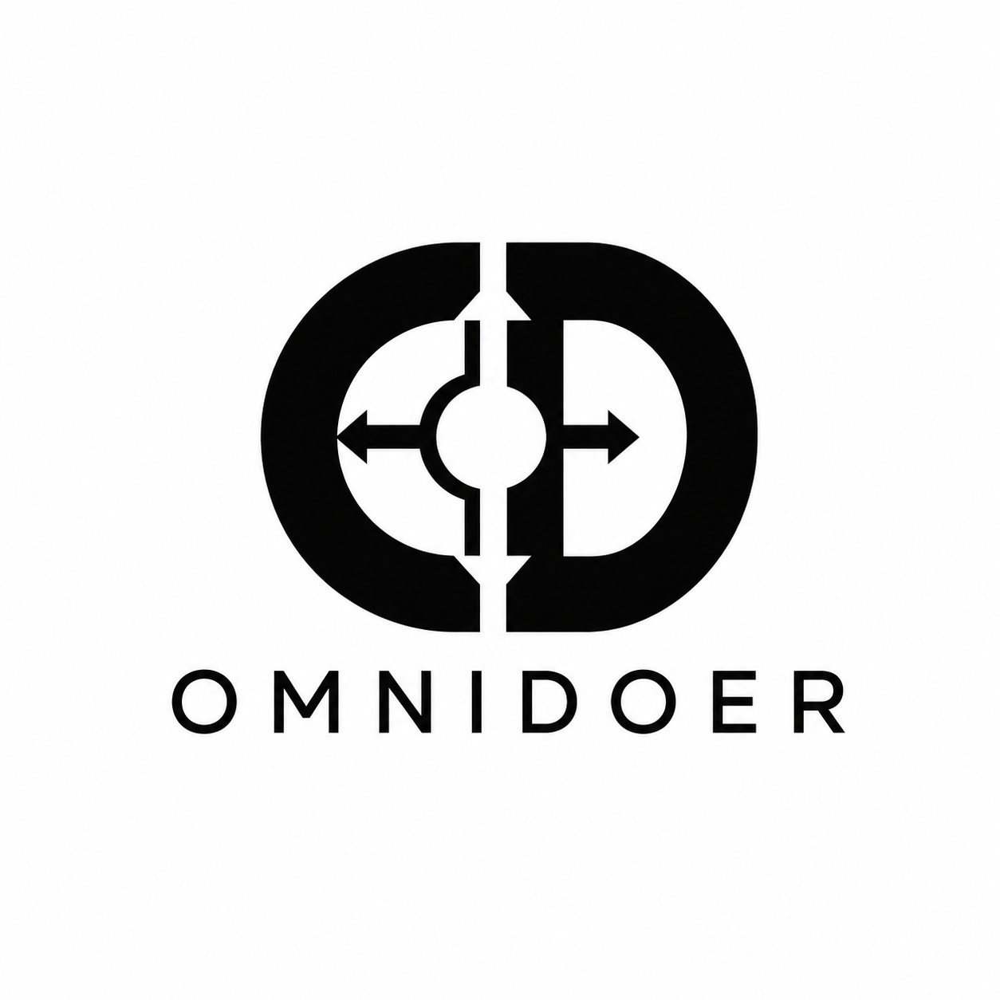
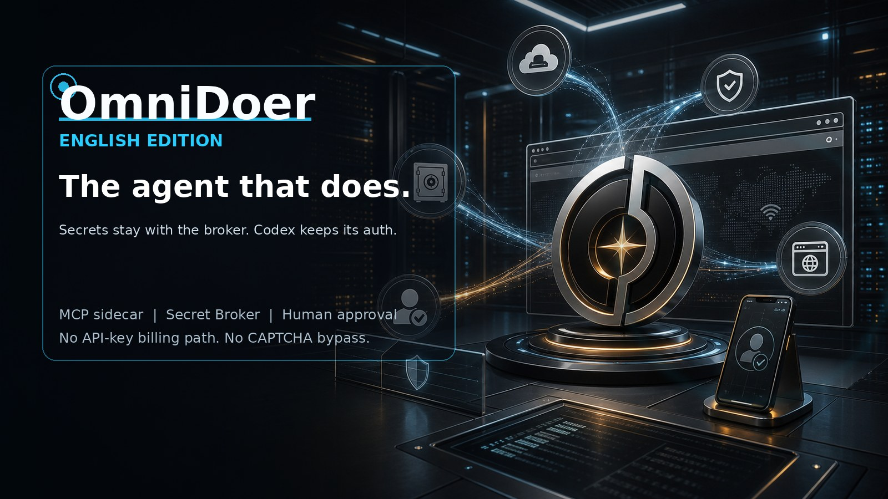

# OmniDoer

All-purpose web action, inside the security boundary.



OmniDoer is the secure execution layer for agents that need to operate real
websites, not just describe them. Its product thesis is simple: if an
authorized human can complete a workflow in a browser, OmniDoer should be able
to help complete that workflow on the user's Linux runtime inside a strict
security boundary. The user takes over whenever authentication, consent,
payment, registration, or anti-bot judgment must stay human.

Codex remains the reasoning engine. OmniDoer adds the controlled browser,
Linux-side runtime, Secret Broker, encrypted Vault, Control Client, challenge
relay, approval gate, audit trail, and human-takeover bridge that turn model
reasoning into user-authorized web action.

The target is broad web capability without unsafe shortcuts: open sites, sign
up, log in, navigate, fill forms, upload and download files, organize
information, prepare purchases, review payments, and hand the live browser to
the user whenever a site requires human authentication, judgment, or consent.



Live page: [https://omnidoer.github.io/](https://omnidoer.github.io/)

## One-Command Install

Local developer install:

```sh
curl -fsSL https://raw.githubusercontent.com/OmniDoer/omnidoer/main/omnidoer/scripts/install-cloud-direct.sh | sh
```

Cloud Direct server install behind your own HTTPS reverse proxy:

```sh
curl -fsSL https://raw.githubusercontent.com/OmniDoer/omnidoer/main/omnidoer/scripts/install-cloud-direct.sh | \
  OMNIDOER_CLOUD_DIRECT=1 OMNIDOER_PUBLIC_URL=https://agent.example.com sh
```

The installer clones OmniDoer, creates `~/omnidoer/.venv`, installs the Python
sidecar runtime, installs the Chromium browser worker, runs `omnidoer init`,
self-tests the MCP server, registers `omnidoer mcp serve` with Codex when the
`codex` CLI is available, and starts the Control Service. It preserves your
existing Codex login, model selection, and billing path.

After install:

```sh
~/omnidoer/.venv/bin/omnidoer control pair --print-qr
~/omnidoer/.venv/bin/omnidoer control submit-task "Open the local demo and download my invoice"
```

Set `OMNIDOER_INSTALL_DIR`, `OMNIDOER_HOST`, `OMNIDOER_PORT`, `OMNIDOER_START=0`,
`OMNIDOER_REGISTER_MCP=0`, or `OMNIDOER_SKIP_PLAYWRIGHT=1` to customize the
bootstrap.

Available translations:
[中文](./README.zh-CN.md) |
[Español](./README.es.md) |
[Français](./README.fr.md) |
[Deutsch](./README.de.md) |
[日本語](./README.ja.md) |
[한국어](./README.ko.md)

## Product Promise

OmniDoer exists to make cloud-model web action practical without moving the
security boundary into the model. The Control Client connects to the user's own
Linux server. Codex plans the work. OmniDoer executes through a controlled
browser, Secret Broker, encrypted Vault, approval gate, challenge relay, human
takeover channel, and tamper-evident audit log.

The security loop is deliberately narrow:

1. The Agent may request an action.
2. The Broker checks origin, request scope, and policy.
3. The Vault releases only the use of the secret, not the secret itself.
4. The browser receives the credential or user input through the controlled path.
5. The model receives only redacted status and observations.

OmniDoer is designed to give cloud-model agents more operational freedom than
chat-only or browser-only tools while preserving the user's security boundary.
The model can plan and ask. The Broker, Vault, policy engine, browser
isolation, approval gate, audit log, and Control Client decide what may
actually happen.

The Control Client connects to the user's own Linux server over Cloud Direct
Mode. When a page requires CAPTCHA, graphical verification, MFA, passkey,
WebAuthn, 3DS, registration confirmation, or an anti-bot interaction,
OmniDoer does not bypass the mechanism. It pauses the Agent, projects the live
browser session to the user's client, accepts user input through the takeover
channel, then resumes the Agent after Release Control.

Payments, purchases, account changes, OAuth grants, message sending, and other
sensitive actions stop at an approval gate. The Agent can prepare the action;
the user decides whether it proceeds.

Compared with Codex alone, OmniDoer adds a controlled browser, Secret Broker,
encrypted Vault, Challenge Relay, Human Takeover, Cloud Direct Control Service,
Approval Gate, and tamper-evident audit trail. Compared with local browser
automation demos, OmniDoer treats credential storage, CAPTCHA/MFA/passkey
handoff, payment approval, registration, remote control, screenshots, errors,
and logs as first-class security surfaces.

The result is a cloud-Codex architecture for high-freedom web action: it can
inherit Codex/GPT model capability, multimodal reasoning, and existing Codex
authentication or billing paths, while keeping passwords, OTP seeds, cookies,
private keys, payment credentials, challenge answers, and takeover inputs out
of model-visible context.

OmniDoer is not a credential stealer.
OmniDoer is not a CAPTCHA bypasser.
OmniDoer is not a fraud tool.
OmniDoer is not an autonomous spender.
OmniDoer is a user-authorized execution layer for the user's own runtime.

The agent can act only through the controlled security boundary. Secrets stay
with the Broker, Vault, browser isolation layer, and user-controlled client.

OmniDoer does not call OpenAI APIs directly. It extends Codex CLI through MCP
and preserves your Codex authentication mode. If Codex is logged in with
ChatGPT, OmniDoer uses that Codex path through Codex CLI. If Codex is using an
API key, `omnidoer doctor` warns that this is OpenAI Platform API billing, but
OmniDoer does not switch modes or create a new API client.


## Translations

- English (this document)
- [中文](./README.zh-CN.md)
- [Español](./README.es.md)
- [Français](./README.fr.md)
- [Deutsch](./README.de.md)
- [日本語](./README.ja.md)
- [한국어](./README.ko.md)

## Status

OmniDoer is an upstream-friendly fork of OpenAI Codex CLI with a separate
sidecar runtime for web action. The fork keeps Codex auth, model selection, and
billing behavior intact while adding the execution system Codex needs in order
to operate websites safely.

The project is still early, but the target is intentionally ambitious: an
omni-capable web runtime with real browser control, secure credential storage,
automatic login, 2FA and anti-bot handoff, registration handoff, file download,
payment review, remote takeover, audit verification, and redaction tests that
prove secrets do not enter model-visible outputs.

## Core Rule

The model is not the security boundary.

The security boundary is the combination of:

- Secret Broker
- local encrypted vault
- browser isolation
- origin and form-action policy checks
- redacted observation layer
- human approval for sensitive actions
- audit logs that never contain secrets

The agent can ask to use a credential. It cannot read the credential.


## System Blueprints

These diagrams define the product direction for the Linux-based all-purpose
web action runtime: secure credential storage and login, human takeover for
2FA/anti-bot/registration, and Cloud Direct deployment on a user-owned server.


## Repository Layout

- `codex-rs/`, `codex-cli/`: upstream Codex CLI code kept mergeable.
- `omnidoer/`: OmniDoer sidecar runtime and local demo code.
- `docs/`: OmniDoer design notes for broker, redaction, MCP, payments, and bootstrap.
- `tests/`: initial redaction, policy, and forbidden-tool tests.

## Local Demo

Start the mock website:

```sh
python3 -m omnidoer.demo.server --host 127.0.0.1 --port 8765
```

Open `http://127.0.0.1:8765/`.

The demo includes login, TOTP, dashboard, invoice download, checkout, malicious
prompt injection, malicious iframe, form-action mismatch, HTTP downgrade,
password reveal, fake token leak, fake card number, OAuth grant, and account
deletion pages. It uses only fake local data.

## Codex Integration

Add OmniDoer to Codex as an MCP sidecar:

```sh
codex mcp add omnidoer -- omnidoer mcp serve
```

Control Client and demo agent commands do not require `OPENAI_API_KEY`.

```sh
omnidoer doctor
omnidoer control serve --host 127.0.0.1 --port 8787
omnidoer control submit-task "Log in to the demo site and download my invoice"
omnidoer mcp serve --self-test
```

The Control Client task panel writes to a local queue. Codex can read queued
tasks with `control.next_user_task` over MCP while keeping Codex CLI as the
only model inference entrypoint.

## Control Client

OmniDoer Control Client is the unified user surface for tasks, credential
requests, one-time codes, CAPTCHA/MFA/Passkey/WebAuthn/3DS handoff, Human
Takeover, payment approvals, vault metadata, and audit summaries.

Registration Handoff handles the case where the target website requires a new
user account. The Agent can open the registration page, then pause and proxy
that live browser session to the Control Client. The user completes signup,
verification, CAPTCHA/passkey prompts, and terms acceptance directly. OmniDoer
does not automate fake or bulk registration, and registration secrets or
challenge answers are not returned to Codex/MCP.

Local development can run on `127.0.0.1`. Cloud Direct Mode lets Android,
Windows 11, and PWA clients connect directly to the user's own cloud server
over HTTPS/WSS with pairing, device identity, session auth, origin protection,
rate limiting, and end-to-end encrypted secret submission.

```sh
omnidoer control serve --cloud-direct \
  --host 0.0.0.0 \
  --port 8787 \
  --public-url https://agent.example.com \
  --behind-reverse-proxy

omnidoer control pair --print-qr
```

MCP remains local to Codex CLI. Vault, Broker, Challenge Relay, and browser
internal interfaces are not public Control Service APIs.


## Client Release

The PWA Control Client is packaged from `omnidoer/omni_control/static/` and
published as a GitHub Release asset named `omnidoer-control-client-pwa.zip`.
The release artifact is static UI only; it does not contain model credentials,
Codex auth data, vault data, pairing tokens, session tokens, secrets, or
challenge answers.

## MVP Target

The first accepted end-to-end flow is:

```sh
omnidoer init
omnidoer vault create
omnidoer cred add --origin http://localhost:PORT
omnidoer demo start
omnidoer agent run "Log in to the demo site and download my invoice"
```

The guarded browser flow extends that target:

```sh
omnidoer agent run "guarded browser 2FA handoff"
```

It logs in with a Vault credential, detects the TOTP page, routes it through
Challenge Relay, resumes at the dashboard, opens the anti-bot mock page, hands
control to the user, then resumes the Agent after Release Control.

Expected safety properties:

- The broker verifies the current origin before filling credentials.
- The browser receives credentials through a broker-controlled path.
- MCP tool results never contain passwords, TOTP seeds, cookies, API keys, or private keys.
- DOM and accessibility observations redact password fields and secret-like values.
- Audit logs record actions and policy decisions without secrets.
- Mock payment submission stops for human approval.
- 2FA and anti-bot pages trigger user completion instead of automated bypass.
- Human takeover frames are for the Control Client only and are not sent to the model.

## Upstream

OmniDoer is forked from [openai/codex](https://github.com/openai/codex).
Changes should remain small and mergeable with upstream. Prefer adding
OmniDoer functionality as a sidecar, plugin, MCP server, or narrowly scoped
integration layer before modifying Codex core crates.
