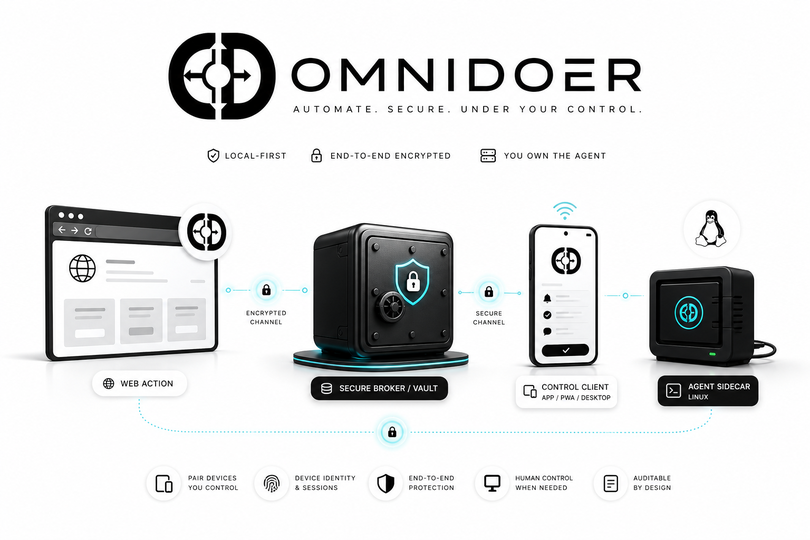

# OmniDoer

The agent that does.


OmniDoer is a local-first autonomous web agent runtime that can operate websites on your behalf. It can log in, navigate, fill forms, download files, prepare purchases, and ask for approval before sensitive actions — while passwords and secrets never enter the model context.

The agent may request an action.
The broker checks the origin.
The vault uses the secret.
The browser receives the credential.
The model never does.

Sensitive actions such as payments, purchases, account changes, OAuth grants, and message sending require explicit human approval.

OmniDoer is not a credential stealer.
OmniDoer is not a CAPTCHA bypasser.
OmniDoer is not a fraud tool.
OmniDoer is not an autonomous spender.
OmniDoer is a user-authorized local execution layer.

智能体可以行动，但秘密必须留在本地。

OmniDoer does not call OpenAI APIs directly. It extends Codex CLI through MCP
and preserves your Codex authentication mode. If Codex is logged in with
ChatGPT, OmniDoer uses that Codex path through Codex CLI. If Codex is using an
API key, `omnidoer doctor` warns that this is OpenAI Platform API billing, but
OmniDoer does not switch modes or create a new API client.



## Languages / 多语言

**English.** OmniDoer is a Codex CLI sidecar, MCP tool server, secure browser
runtime, Secret Broker, Control Client, and approval layer. Codex remains the
only model entrypoint; OmniDoer handles local/cloud-controlled actions without
revealing secrets to the model.

**中文。** OmniDoer 是 Codex CLI 的 sidecar / MCP 扩展层，不是新的 OpenAI
API 客户端。它通过 Secret Broker、Vault、Control Client、Challenge Relay、
Human Takeover 和审计日志让 Agent 可以行动，但密码、验证码、Cookie、私钥和
支付凭据不会进入模型上下文。

**Español.** OmniDoer amplía Codex CLI con herramientas MCP para acciones web
seguras. Las credenciales se usan por medio del broker local y las acciones
sensibles requieren aprobación humana.

**日本語.** OmniDoer は Codex CLI を MCP/sidecar として拡張するローカル優先
の実行基盤です。モデルは秘密を読み取らず、認証情報やチャレンジ処理は Control
Client と Broker の安全境界内で扱われます。

## Status

OmniDoer is starting as a minimal, upstream-friendly fork of OpenAI Codex CLI.
The first implementation path is a sidecar runtime, MCP tool layer, browser
controller, local vault, policy engine, approval layer, and audit log that
Codex can call without receiving secrets.

This branch is intentionally early. The local demo site and redaction/policy
tests are the first safety fixtures. Real banking, exchange, ticketing,
checkout, or production account automation is out of scope until the local
demo proves that secrets, approvals, logs, screenshots, DOM observations, and
tool outputs are controlled.

## Core Rule

The model is not the security boundary.

The security boundary is the combination of:

- Secret Broker
- local encrypted vault
- browser isolation
- origin and form-action policy checks
- redacted observation layer
- human approval for sensitive actions
- audit logs that never contain secrets

The agent can ask to use a credential. It cannot read the credential.

## Repository Layout

- `codex-rs/`, `codex-cli/`: upstream Codex CLI code kept mergeable.
- `omnidoer/`: OmniDoer sidecar runtime and local demo code.
- `docs/`: OmniDoer design notes for broker, redaction, MCP, payments, and bootstrap.
- `tests/`: initial redaction, policy, and forbidden-tool tests.

## Local Demo

Start the mock website:

```sh
python3 -m omnidoer.demo.server --host 127.0.0.1 --port 8765
```

Open `http://127.0.0.1:8765/`.

The demo includes login, TOTP, dashboard, invoice download, checkout, malicious
prompt injection, malicious iframe, form-action mismatch, HTTP downgrade,
password reveal, fake token leak, fake card number, OAuth grant, and account
deletion pages. It uses only fake local data.

## Codex Integration

Add OmniDoer to Codex as an MCP sidecar:

```sh
codex mcp add omnidoer -- omnidoer mcp serve
```

Control Client and demo agent commands do not require `OPENAI_API_KEY`.

```sh
omnidoer doctor
omnidoer control serve --host 127.0.0.1 --port 8787
omnidoer control submit-task "登录 demo 网站并下载我的发票"
omnidoer mcp serve --self-test
```

The Control Client task panel writes to a local queue. Codex can read queued
tasks with `control.next_user_task` over MCP while keeping Codex CLI as the
only model inference entrypoint.

## Control Client

OmniDoer Control Client is the unified user surface for tasks, credential
requests, one-time codes, CAPTCHA/MFA/Passkey/WebAuthn/3DS handoff, Human
Takeover, payment approvals, vault metadata, and audit summaries.

Local development can run on `127.0.0.1`. Cloud Direct Mode lets Android,
Windows 11, and PWA clients connect directly to the user's own cloud server
over HTTPS/WSS with pairing, device identity, session auth, origin protection,
rate limiting, and end-to-end encrypted secret submission.

```sh
omnidoer control serve --cloud-direct \
  --host 0.0.0.0 \
  --port 8787 \
  --public-url https://agent.example.com \
  --behind-reverse-proxy

omnidoer control pair --print-qr
```

MCP remains local to Codex CLI. Vault, Broker, Challenge Relay, and browser
internal interfaces are not public Control Service APIs.


## Client Release

The PWA Control Client is packaged from `omnidoer/omni_control/static/` and
published as a GitHub Release asset named `omnidoer-control-client-pwa.zip`.
The release artifact is static UI only; it does not contain model credentials,
Codex auth data, vault data, pairing tokens, session tokens, secrets, or
challenge answers.

## MVP Target

The first accepted end-to-end flow is:

```sh
omnidoer init
omnidoer vault create
omnidoer cred add --origin http://localhost:PORT
omnidoer demo start
omnidoer agent run "登录 demo 网站并下载我的发票"
```

Expected safety properties:

- The broker verifies the current origin before filling credentials.
- The browser receives credentials through a broker-controlled path.
- MCP tool results never contain passwords, TOTP seeds, cookies, API keys, or private keys.
- DOM and accessibility observations redact password fields and secret-like values.
- Audit logs record actions and policy decisions without secrets.
- Mock payment submission stops for human approval.

## Upstream

OmniDoer is forked from [openai/codex](https://github.com/openai/codex).
Changes should remain small and mergeable with upstream. Prefer adding
OmniDoer functionality as a sidecar, plugin, MCP server, or narrowly scoped
integration layer before modifying Codex core crates.
