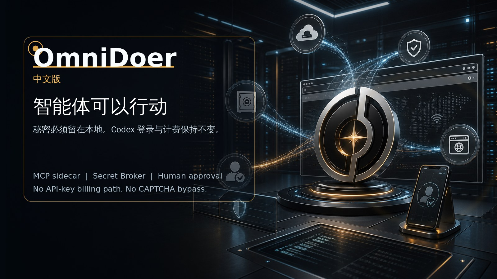

# OmniDoer



[English](./README.md) | [Español](./README.es.md) | [Français](./README.fr.md) | [Deutsch](./README.de.md) | [日本語](./README.ja.md) | [한국어](./README.ko.md)

## 一键部署

本地开发安装：

```sh
curl -fsSL https://raw.githubusercontent.com/OmniDoer/omnidoer/main/omnidoer/scripts/install-cloud-direct.sh | sh
```

在自己的 HTTPS 反向代理后部署 Cloud Direct 服务器：

```sh
curl -fsSL https://raw.githubusercontent.com/OmniDoer/omnidoer/main/omnidoer/scripts/install-cloud-direct.sh | \
  OMNIDOER_CLOUD_DIRECT=1 OMNIDOER_PUBLIC_URL=https://agent.example.com sh
```

安装后生成配对码并提交任务：

```sh
~/omnidoer/.venv/bin/omnidoer control pair --print-qr
~/omnidoer/.venv/bin/omnidoer control submit-task "打开本地 demo 并下载我的发票"
```

安装脚本会创建 `~/omnidoer/.venv`、初始化 OmniDoer、安装浏览器 worker、
自检 MCP server，并在 `codex` CLI 可用时注册 `omnidoer mcp serve`。

OmniDoer 是 Codex CLI 的 MCP/sidecar 全能网页行动层，不是新的 OpenAI API 客户端。Codex 负责推理，OmniDoer 负责真实执行：打开网页、注册账号、登录、填写表单、下载文件、整理资料、准备订单、请求审批，并在挑战或高风险页面前把控制权交还给用户。

如果一件事需要人类授权后在网页上完成，OmniDoer 的目标就是在安全边界内接力完成。它补上原版 Codex 缺少的真实浏览器、Secret Broker、Vault、Control Client、Challenge Relay、Human Takeover、Cloud Direct、Approval Gate 和审计链。

核心规则：Agent 可以请求使用 secret，但不能读取 secret。Codex 仍然是唯一模型推理入口，OmniDoer 不默认要求 `OPENAI_API_KEY`，不创建新的 OpenAI API billing path，也不修改 Codex 的 ChatGPT 登录、计费或模型提供方逻辑。

Control Client 负责凭据输入、挑战交互、Human Takeover、注册代理、支付审批和审计查看。遇到 CAPTCHA、MFA、Passkey、WebAuthn、3DS、账号注册确认或高强度 anti-bot 页面时，OmniDoer 不绕过、不破解、不代答，而是把真实浏览器页面或挑战请求交给用户本人完成。

Cloud Direct Mode 允许 Android、Windows 11 和 PWA 客户端直接连接用户自己的云服务器。公网模式必须显式启用 HTTPS/WSS、pairing、设备身份、会话认证、Origin/CSRF 防护、限速和端到端加密 secret submission。
